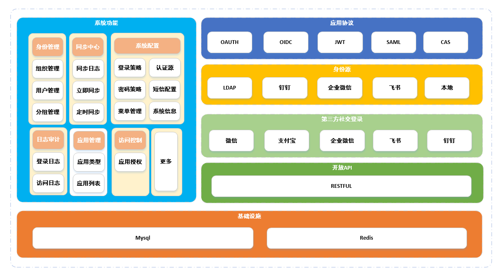

## 项目介绍

基于OpenLDAP企业级认证平台(EIAM)，用于管理企业组织架构、员工账号、身份认证、应用访问，帮助整合本地或云端的业务系统及第三方 SaaS 系统的所有身份，实现一个账号登录访问所有应用。支持OAuth2.x、OIDC、SAML2.0、JWT、CAS等SSO标准协议。

官网地址：http://ldapauth.com

官网邮箱：contact@ldapauth.com

付费服务支持或商务合作：

--------------------------

⭐️ 如果你喜欢 LdapAuth，请给它一个 Star，您的支持将是我们前行的动力。

--------------------------

## 核心特性

+ 基于OpenLDAP企业级认证平台(EIAM)，用于管理企业组织架构、员工账号、身份认证、应用访问统一管理。
+ 支持企业微信,钉钉,飞书,OpenLDAP等开箱即用数据源。
+ 支持图片动态验证码、短信验证码、Google/Microsoft Authenticator/FreeOTP/支持TOTP或者HOTP，保证用户认证安全可靠。
+ 支持微信、钉钉、飞书QQ等社交认证集成，使企业具有快速纳入互联网化认证能力。
+ 支持 `SAML2`，`OAuth2`，`OIDC`，`CAS`，`JWT`等认证协议及机制，实现单点登录功能。
+ 完善的安全审计，详尽记录每一次用户行为，使每一步操作有据可循，实时记录企业信息安全状况，精准识别企业异常访问和潜在威胁的源头。

## 系统架构

## 功能描述

| 功能模块 | 功能项      | 功能描述                                                                                                                                                      |
|------|----------|-----------------------------------------------------------------------------------------------------------------------------------------------------------|
| 我的应用 | 我的应用     | 用户已授权的应用列表，点击应用，无需二次密码输入，快速单点到业务系统。                                                                                                                       |
| 身份管理 | 组织管理     | 组织管理解决企业组织管理问题。这些实体您可以直接在LDAPAUTH中进行维护，也可以通过配置LDAPAUTH身份源后，同步身份源的数据。                                                                                      |
|      | 用户管理     | 用户管理解决企业用户管理问题。这些实体您可以直接在LDAPAUTH中进行维护，也可以通过配置LDAPAUTH身份源后，同步身份源的数据。                                                                                      |
|      | 用户组管理    | 用户组管理，这些实体您可以直接在LDAPAUTH中进行维护，可以授权组成员、菜单、应用的权限等基本操作                                                                                                       |
| 应用管理 | OIDC协议应用 | OIDC是OpenID Connect的简称，OIDC=(Identity, Authentication) + OAuth 2.0。它在OAuth2上构建了一个身份层，是一个基于OAuth2协议的身份认证标准协议。OIDC是一个协议族，提供很多的标准协议，包括Core核心协议和一些扩展协议。       |
|      | JWT协议应用  | JWT（JSON Web Token）是在网络应用环境声明的一种基于 JSON 的开放标准。LdapAuth 使用 JWT 进行分布式站点的单点登录 （SSO）。JWT 单点登录基于非对称加密，由 LdapAuth 将用户状态和信息使用私钥加密，传递给应用后，应用使用公钥解密并进行验证。使用场景非常广泛，集成简单。 |
|      | SAML协议应用 | SAML（Security Assertion Markup Language 安全断言标记语言）是一个基于XML的开源标准数据格式，为在安全域间交换身份认证和授权数据，尤其是在IDP（Identity Provider身份提供方）和SP（Service Provider 服务提供方）之间。        |
|      | CAS协议应用  | CAS是Central Authentication Service的缩写，中央认证服务，一种独立开放指令协议。。                                                                                                 |
| 访问控制 | 应用授权     | 授权用户组与应用访问权限                                                                                                                                              |
| 同步中心 | 钉钉       | 钉钉(Ding Talk)是阿里巴巴集团打造的企业级智能移动办公平台,以钉钉作为数据源，同步钉钉的组织与用户到平台。提供日志审计等功能                                                                                       |
|      | 飞书       | 飞书是北京抖音信息服务有限公司于2016年自研的新一代一站式协作平台，以飞书作为数据源，同步飞书的组织与用户到平台。提供日志审计等功能                                                                                        |
|      | 企业微信     | 企业微信是腾讯微信团队为企业打造的专业办公管理工具，以企业微信作为数据源，同步企业微信的组织与用户到平台。提供日志审计等功能                                                                                            |
| 日志审计      | 登录日志     | 审计日志记录了所有平台用户进行登录的关键操作，以对用户登录行为提供溯源数据。                                                                                                                     |
|           | 访问日志     | 审计日志记录了所有平台用户进行应用访问的关键操作，以对用户访问应用的行为提供溯源数据。                                                                                                                |
| 系统设置      | 系统信息     | 主要对系统的基本信息维护                                                                                                                                               |
|           | 菜单配置     | 系统导航菜单、按钮、API接口等基本数据录入。                                                                                                                                    |
|           | 密码策略     | 密码策略中可以设置相应的密码复杂度、相应的锁定解锁策略。                                                                                                                               |
|           | 登录策略     | 登录策略负责保证系统登录的安全性。 如令牌有效期、密码错误次数锁定以及登录的图形验证码基本控制。                                                                                                           |
|           | LDAP数据源  | 为系统提供数据源的入口，可以同步LDAP的数据到平台，可以查看具体的同步记录和任务调度。                                                                                                               |
|           | 短信配置    | 主要提供短信配置入口，为用户自助找回密码提供短信功能的基础配置。                                                                                                                       |
|           | 第三方认证    | 基础主流的社交登录配置，如微信、支付宝、企业微信、飞书等市场主流的社交登录能力。                                                                                                                   |

## 技术选型
#### 后端技术

| 框架                     | 说明            | 版本     |
|------------------------|---------------|--------|
| Spring Boot            | 系统框架          | 2.7.18 |
| Spring Cloud Alibaba   | 系统框架         | 2021.1 |
| Freemarker             | 模板引擎         | 2.3.32| 
| Knife4j                | API文档         | 4.0.0 | 
| Mysql Connector        | 数据库驱动         | 8.0.31 |
| Druid                  | JDBC 连接池、监控组件 | 1.2.16 |
| Spring-Boot-Data-Redis | Redis         | 2.7.18 |
| MyBatis Plus           | MyBatis 增强工具包 | 3.5.4 | 
| Hutool                 | Java工具类库      | 5.8.15 | 
| Lombok                 | 消除冗长的 Java 代码 | 1.18.26 | 
| Ip2region              | IP解析工具        | 2.6.5 | 
| Pinyin4j               | 文字转换工具        | 2.5.1 |
| JavaxMail              | 邮件发送工具        | 1.6.2 |

#### 前端技术

| 框架           | 说明        | 版本     | 
|--------------|-----------|--------|
| vue          | 框架语言      | 3.4.31 |
| vite         | 构建工具      | 5.3.2 | 
| element-plus | 组件库       | 2.7.6 |
| axios        | 网络库     | 0.28.1 | 
| js-cookie    | Cookie库 | 3.0.5 |
| jsencrypt    | 数据加解密库  | 3.3.2|
| echarts      | 报表库       | 5.5.1 | 

